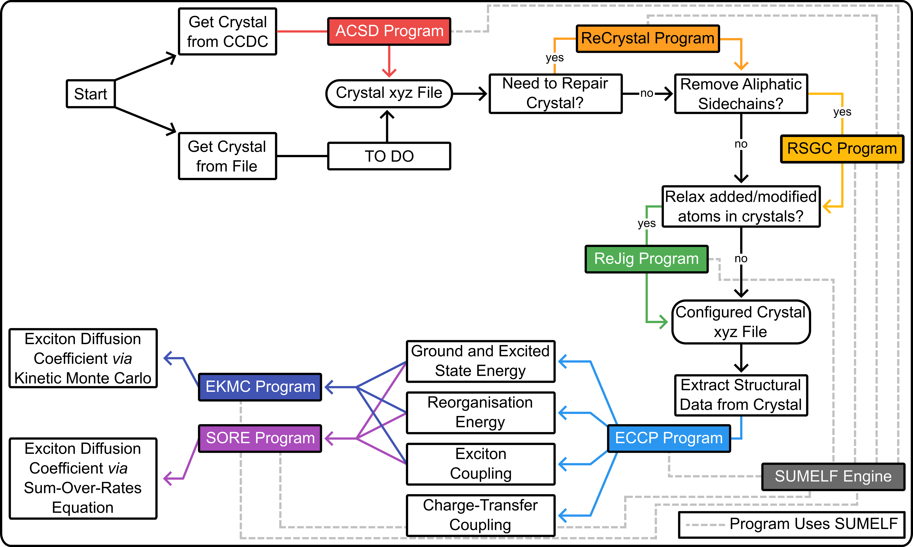

# The Sum-Over-Rates for Excitons (SORE) Program

Authors: Dr. Geoffrey Weal<sup>\*,†</sup>, Dr. Chayanit Wechwithayakhlung<sup>†</sup>, Assoc. Prof. Daniel Packwood<sup>†</sup>, Dr. Paul Hume<sup>\*</sup>, Prof. Justin Hodgkiss<sup>\*</sup>

<sup>\*</sup> Victoria University of Wellington, Wellington, New Zealand; The MacDiarmid Institute for Advanced Materials and Nanotechnology, Wellington, New Zealand. 

<sup>†</sup> Institute for Integrated Cell-Material Sciences (iCeMS), Kyoto University, Kyoto, Japan.

Group pages: https://people.wgtn.ac.nz/paul.hume/grants, https://www.packwood.icems.kyoto-u.ac.jp/, https://people.wgtn.ac.nz/justin.hodgkiss/grants


## What is the Sum-Over-Rates for Excitons (SORE) Program

The Sum-Over-Rates for Excitons (SORE) program calculates the exciton diffusion coefficient of a molecular crystal using a sum-over-rates equation.

SORE answers the same question as the [EKMC program](https://github.com/geoffreyweal/EKMC) — how fast does an exciton diffuse through this crystal — but does so analytically rather than by simulating individual exciton trajectories. Where EKMC runs many kinetic Monte Carlo simulations and averages them, SORE sums the hopping rate constants directly. This makes SORE much faster, at the cost of the detail that an explicit trajectory gives you.

SORE uses the same electronic data as EKMC: excited-state energies, reorganisation energies, and exciton (EET) couplings obtained from DFT by the [ECCP program](https://github.com/geoffreyweal/ECCP).

SORE can be run in three modes, set by ``SORE_settings['mode']``:

* ``standard``: Sum over the rate constants directly, with no energetic disorder.
* ``analytical_energetic_disorder``: Include energetic disorder, treated analytically.
* ``numeric_energetic_disorder``: Include energetic disorder, treated numerically.

## Installation

SORE depends only on the [SUMELF](https://github.com/geoffreyweal/SUMELF) program, which provides the shared machinery it uses to build the crystal neighbourhood and the rate-constant data. You do not need to install EKMC or ECCP to run SORE.

SUMELF is not on PyPI, so install SORE from GitHub — this will pull SUMELF in automatically:

```bash
pip3 install --upgrade --user git+https://github.com/geoffreyweal/SORE.git
```

## Guide To Using SORE

The SORE program is one in a series of programs that are designed to be used in the workflow shown below.

SORE is a python library rather than a terminal command: you drive it from a ``Run_SORE.py`` script. It takes the same ``EKMC_settings`` dictionary that you would give to the EKMC program, plus a ``SORE_settings`` dictionary:

```python
from SORE import Run_SORE

# EKMC_settings is the same settings dictionary used by the EKMC program.
SORE_settings = {'mode': 'standard'}

Run_SORE(EKMC_settings, SORE_settings=SORE_settings, no_of_cpus_for_setup=1)
```

``Run_SORE`` accepts the following arguments:

* ``EKMC_settings`` (*dict.*): The crystal, coupling and kinetics settings, in the same format the EKMC program uses.
* ``SORE_settings`` (*dict.*): The SORE settings. Must contain ``mode`` (see the three modes above).
* ``save_initial_data`` (*bool.*): If ``True``, save the neighbourhood and coupling data obtained during setup so it can be reused on a later run. Default: ``False``.
* ``no_of_cpus_for_setup`` (*int.*): The number of CPUs to use when setting up the crystal neighbourhood. Default: ``1``.

## The Grand Scheme

The SORE program is used as part of a grand scheme for calculating the excited-state electronic properties of molecules in a crystal. This includes simulations of exciton and charge diffusion through crystal structures, in particular for organic molecules (but not limited to them). This scheme is shown below, along with where the SORE program is used in this scheme. 



## Websites and Github Repositories for All Associated Programs

### Instructional Websites

* ACSD: https://geoffreyweal.github.io/ACSD
* ReCrystals: https://geoffreyweal.github.io/ReCrystals
* RSGC: https://geoffreyweal.github.io/RSGC
* ReJig: https://geoffreyweal.github.io/ReJig
* ECCP: https://geoffreyweal.github.io/ECCP
* EKMC: https://geoffreyweal.github.io/EKMC
* SORE: https://geoffreyweal.github.io/SORE
* SUMELF: https://geoffreyweal.github.io/SUMELF

### Github Repositories

* ACSD: https://github.com/geoffreyweal/ACSD
* ReCrystals: https://github.com/geoffreyweal/ReCrystals
* RSGC: https://github.com/geoffreyweal/RSGC
* ReJig: https://github.com/geoffreyweal/ReJig
* ECCP: https://github.com/geoffreyweal/ECCP
* EKMC: https://github.com/geoffreyweal/EKMC
* SORE: https://github.com/geoffreyweal/SORE
* SUMELF: https://github.com/geoffreyweal/SUMELF
